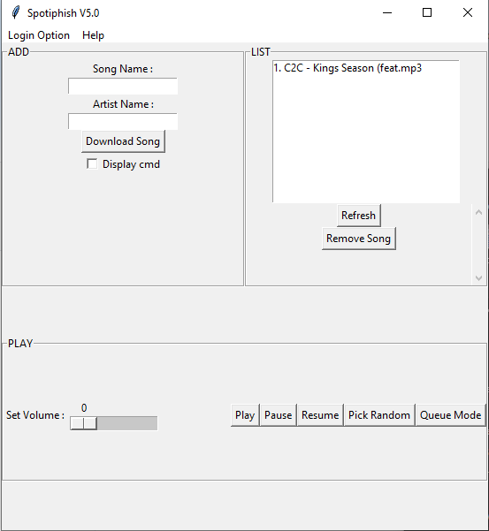

## Spotiphish
> Search, Download, Play music.

Spotiphish is a music searcher, downloader, and player.



## Installation

/!\ Need Python and Tkinter

Windows:

```sh
pip install youtube-dl
pip install moviepy
pip install youtube-search
pip install pygame
```
Linux:

```sh
pip install youtube-dl
pip install moviepy
pip install youtube-search
pip install pygame
```

## Usage example

To search a music and download it just by pressing a button.


## Release History

* 0.3.1
    * V6
* 0.3.0
    * V5
* 0.2.1
    * V4
* 0.2.0
    * V3
* 0.1.1
    * V2
* 0.1.0
    * V1
* 0.0.1
    * Work in progress

## Meta

Ph3nX-Z

[https://github.com/Ph3nX-Z/](https://github.com/dbader/)

## Contributing

1. Fork it (<https://github.com/yourname/yourproject/fork>)
2. Create your feature branch (`git checkout -b feature/fooBar`)
3. Commit your changes (`git commit -am 'Add some fooBar'`)
4. Push to the branch (`git push origin feature/fooBar`)
5. Create a new Pull Request
